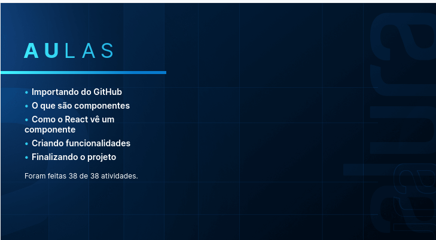

<h1 align="center">React: como os componentes funcionam</h1>
<p align="center">
    Aprendendo sobre componentes do React.js. 
</p>
<p align="center">
    No modulo 1 só foi feito a parte de pegar o projeto no github e preparar ele pra rodar com <em><strong>npm i</strong></em>.
</p>
<p align="center">
    No modulo 2 falou-se mais sobre os componentes do react, fazendo uma comparação entre um componente e suas props com uma peça de lego, onde cada prop seria uma parte de encaixe do lego. Para mim ficou mais claro em pensar o componente como um objeto de POO, onde as props são os atributos e métodos, mas quando esse obj é criado em outro local é necessario passar todas as props dele, seja atributo ou método. Também foi falado sobre <em><strong>closure</strong></em>, que é uma forma de compartilhar variáveis em escopos diferentes, no react é mais usado para manipular eventos em componentes funcionais, apesar que esse conceito ainda está um tanto nebuloso para mim. Nesse modulo também foi falado sobre o <em><strong>react-icons</strong></em> e como usa-lo.
</p>
<p align="center">
    No modulo 3 falou-se sobre inputs não-controlados, que são aqueles que não tem um onAlgo. também foi falado que o react só ver mudanças em state, ele não trabalha nas consts. Essa mudança nos states ocorre por causa do virtual DOM, que ver a mudança feita no state e atualiza o DOM só no que for necessario. 
</p>
<p align="center">
    No modulo 4 foi apresentado o <em><strong>uuid</strong></em>, que é um gerador de id. Além disso, foi mostrado que o react funciona com <em><strong>one way data binding</strong></em>, ou seja, a informação só é transferida do pai para o filho, não ocorre da informação ir do filho pro pai. Também foi mostrado que uma das razões de usar <em><strong>função anonima em onClick</strong></em> e derivados e pelo motivo dela não ativar ao ser renderizado, algo que aconteceria se fosse usado apenas a função normalmente. Outra forma de fazer isso sem função anonima é criando uma função X no componente que vai ter apenas a função desejada com os (), então vai passar a X sem () no onClick.
</p>
<p align="center">
    No modulo 5 descobri que o wrap é de corte de linha. Também foi mostrado como passa parametros para uma tag em forma de uma const, os passos são: criar uma const com os dados, exemplo: <em><strong>const props = { size: 25, onClick: function}</strong></em>; então passar o nome dessa const entre chaves e com spread dentro da tag, exemplo: <em><strong>{...props}</strong></em>, pronto, a tag vai ter as propriedades que estiver na const.
</p>


<p align="center">
    Curso feito na <a href="https://cursos.alura.com.br/">Alura</a>, ministrado por
    <a href="https://www.linkedin.com/in/lfrprazeres/">Luiz Fernando Ribeiro</a>.
</p>

### :bookmark_tabs: Pré-requesitos

Para rodar essa aplicação é necessario as seguintes ferramentas:

<ul>
    <li><a href="https://git-scm.com">Git</a></li>
    <li><a href="https://nodejs.org/en/">Node.js</a></li>
</ul>

### :gear: Colocando para funcionar

```bash
# Clone o repositorio na pasta desejada
$ git clone https://github.com/DanielVII/treino.git
```

```bash
# Acesse a pasta  onde foi feito o clone
$ cd suaPasta/
```

```bash
# Instale as dependências
$ npm install
```

```bash
# Agora é só abrir
$ npm start
```

### Resumo Aulas


